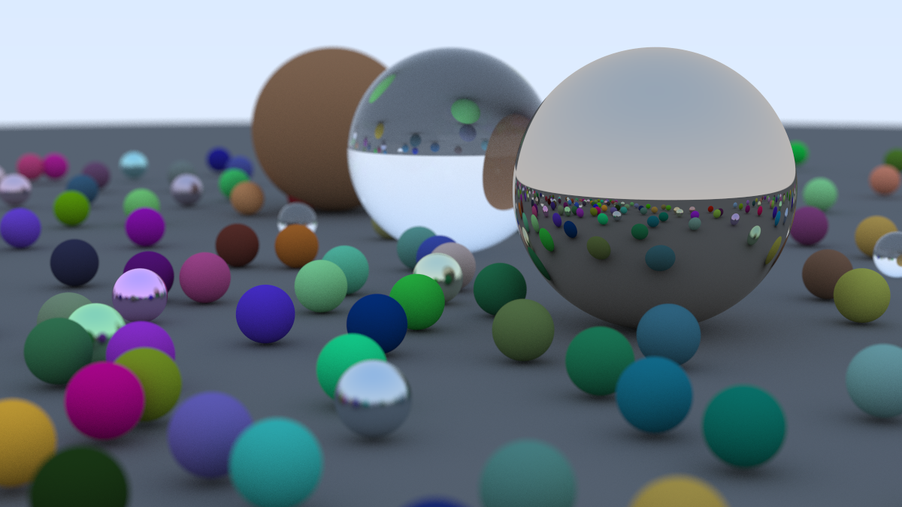

# Ray Tracing

A CPU-based ray tracer implementation in C++ that generates photorealistic images by simulating the physics of light rays interacting with 3D objects.



## Overview

This project implements a complete ray tracing engine from scratch, following the principles outlined in [_Ray Tracing in One Weekend_](https://raytracing.github.io/books/RayTracingInOneWeekend.html). The ray tracer simulates how light rays travels, calculating reflections, refractions, and colour interactions to produce realistic images.

## Features

### 1. Materials
- **Lambertian (Diffuse)**: Matte surfaces that scatter light uniformly in all directions
- **Metal**: Reflective surfaces with configurable fuzziness for realistic metal materials
- **Dielectric**: Transparent materials like glass that support refraction and reflection using Snell's law and Schlick's approximation

### 2. Camera System
- Configurable aspect ratio, resolution, and field of view
- Realistic camera defocus blur for depth perception

### 3. Rendering Features
- Recursive ray tracing with configurable maximum depth (light bounces)
- Gradient sky background
- Monte Carlo anti-aliasing with multiple samples per pixel for smooth, noise-free images

## Building and Running

### Requirements
- C++11 compatible compiler
- Make

### Build and Run
```bash
make
./main > image.ppm
```


The program outputs a PPM image file that can be viewed with most image viewers or converted to other formats.

### Clean
```bash
make clean
```

## Technical Details

- **Language**: C++11
- **Architecture**: Object-oriented design with virtual material classes
- **Sampling**: Monte Carlo method with configurable samples per pixel (default: 50)
- **Ray Depth**: Configurable max bounces per ray for accurate light simulation (default: 50)
- **Output Resolution**: 300x168 pixels (16:9 aspect ratio)
